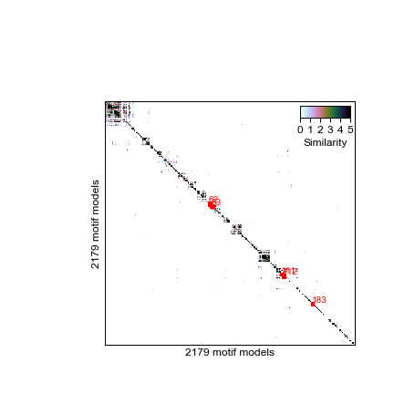
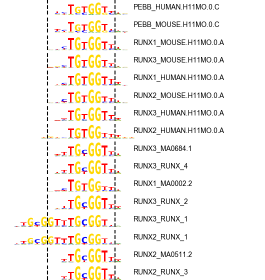

# motif-clustering
Clustering motif models to remove redundancy

## Requirements

- Python 2.7
  - numpy, scipy
  - genome-tools (http://www.github.com/jvierstra/genome-tools)
- Tomtom (http://meme-suite.org/doc/download.html)

## Included motif databases

- Jolma et al., Cell 2013 (Supplemental Table 2) 
- JASPAR 2018
- HOCOMOCO version 11 (757 motif models; both human and mouse)

## Pre-computed data (GRCh38/hg38)

We have pre-computed genome-wide scans for both human and mouse genomes.
- Human (GRCh38/h38)
	- Full motif matches (2179 motif models)
	- Collapsed motifs by similarity (286 motif clusters)
- Mouse (mm10)
	- Full motif matches (2179 motif models)
	- Collapsed motifs by similarity (286 motif clusters)

## Step 1: Compute pair-wise motif similarity

Here we TOMTOM to determine the similarity between all motif models (all pairwise) with the following code:

```
meme2meme databases/*/*.meme > tomtom/all.dbs.meme

tomtom \
	-bfile /net/seq/data/projects/motifs/hg19.K36.mappable_only.5-order.markov \
	-dist kullback \
	-motif-pseudo 0.1 \
	-text \
	-min-overlap 1 \
	tomtom/all.dbs.meme tomtom/all.dbs.meme \
> tomtom/tomtom.all.txt
```

I have a provided a script that will load this operation up on a SLURM parallel compute cluster (see [e](runall))

## Step 2: Hierarchically cluster motifs by similarity

```
python2 hierarchical.py tomtom/tomtom.all.txt tomtom
```

This script performs hierarchical clustering (distance: correlation, complete linkage) and provides an output of cluster assignments at a range of tree heights (0.5-1). Below is a heatmap representation of motifs clustered by simililarity and clusters identified cutting the dendrogram at height 0.7.



## Step 3: Process each cluster to build a motif archetype

```
mkdir -p tomtom/height.0.70/viz

python2 process_cluster.py \
  tomtom/tomtom.all.txt \
  tomtom/clusters.0.70.txt \
  62 \
  tomtom/height.0.70
```

This command generates two files (per motif cluster).

```
python2 viz_cluster.py \
  tomtom/height.0.70/cluster-info.62.txt \
  tomtom/height.0.70/cluster-motifs.62.txt \
  tomtom/height.0.70/viz/cluster.62 
 ```

This wiil create a PDF and PNG with visualizing motif cluster #62 corresponding to the basic helix-loop-helix DBD containing OLIG/NEUROG. Dashed lines demarcate the boundaries of the "archetypal" motif position. The motif matches for the constituent models have will have their coordinates adjusted to match.


C62:OLIG (bHLH)|  C179:RUNX (RUNX domain)
:-------------------------:|:-------------------------:
| 


```
fetchChromSizes hg38 > /tmp/chrom.sizes
awk -v OFS="\t" '{ print $1, 0, $2; }' /tmp/chrom.sizes | sort-bed - > /tmp/chrom.sizes.bed
zcat moods.combined.all.bed.gz | bedops -e 100% - /tmp/chrom.sizes.bed \
| python2 /home/jvierstra/proj/code/motif-clustering/relabel.py  \
	/home/jvierstra/proj/code/motif-clustering/tomtom/height.0.70/cluster-info.with.dbd.and.color.csv \
| head -n10000 > /tmp/moods

```

To create a bigBed file from a bed9+2, we need to include an AutoSql file (bed_format.as)
```
table hg38_motifs_collapsed
"Collapsed motifs matches in hg38 (see: http://www.github.com/jvierstra/motif-clustering)"
(
string  chrom;        "Reference sequence chromosome or scaffold"
uint    chromStart;    "Start position of feature on chromosome"
uint    chromEnd;    "End position of feature on chromosome"
string  name;        "Name of gene"
uint    score;        "Score"
char[1] strand;        "+ or - for strand"
uint    thickStart;    "Coding region start"
uint    thickEnd;    "Coding region end"
uint      reserved;    "itemRgb"
string  motif_match_id;    "Motif identifier"
float  motif_match_score;        "Motif match score (MOODS score)"
string DBD;     "DNA binding domain"
uint n; "Number of motif matches from cluster"
)
```
```
bedToBigBed -as=bed_format.as -type=bed9+4 -tab moods.combined.all.bed chrom.sizes moods.combined.all.bb
awk -v OFS="\t" '{ print $1, $2, $3, $4, $11, $6, $10, $13}' moods.combined.all.bed | bgzip -c > moods.combined.all.bed.gz
tabix -p bed moods.combined.all.bed.gz
```
