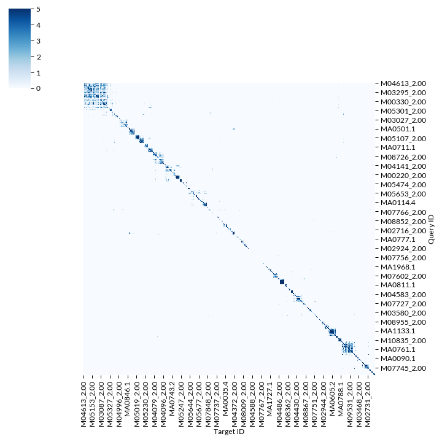
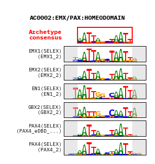
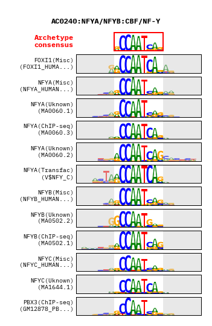

# Non-redundant TF motif matches genome-wide

Below describes the general workflow for clustering motif models to remove redundancy, generating an "archetype" motif, and then finally, performing genome-wide scans of motifs and remvoval of redundancy.
Please note that this documentation is  ***incomplete***, as should be used a a rough guide only.

If you are looking for the final results (motif clusters, genome-wide scans and a browser shot) please see the following website:
https://resources.altius.org/~jvierstra/projects/motif-clustering/

> ***Note***: The above link is for version 1.0 of the motif clusters. While we have yet to update the website, version 2.1-beta (latest) can be found at https://resources.altius.org/~jvierstra/projects/motif-clustering-v2.1beta/.

Contact me at ```jvierstra (at) altius.org``` with any questions/requests/comments.

## Requirements

- Python 3.5+
  - numpy
  - scipy
  - seaborn
  - matplotlib
  - genome-tools (http://www.github.com/jvierstra/genome-tools)
- TOMTOM (http://meme-suite.org/doc/download.html)
- BEDOPS (http://bedops.readthedocs.io)

## Versions

- Version 2.0beta-human (https://resources.altius.org/~jvierstra/projects/motif-clustering-v2.0beta/)
  - CIS-BP (homo sapien; only motifs w/ direct measurement)
  - JASPAR2022
  - BANP from Grand 2021
  - 5,193 total motif model; 693 distinct clusters

- Version 1.0 (complete documation: https://resources.altius.org/~jvierstra/projects/motif-clustering/)
  - Jolma et al., Cell 2013 (Supplemental Table 2) 
  - JASPAR 2018
  - HOCOMOCO version 11 (757 motif models; both human and mouse)

## Quick start

## Step 1: Download and preproces motifs

See `runall` script in each motif database directory (`databases/*`)

## Step 1: Compute pair-wise motif similarity

Here we use TOMTOM to determine the similarity between all motif models (all pairwise) with the following code:

```
meme2meme databases/*/*.meme > tomtom/all.dbs.meme

tomtom \
	-bfile /net/seq/data/projects/motifs/hg19.K36.mappable_only.5-order.markov \
	-dist kullback \
	-motif-pseudo 0.1 \
	-text \
	-min-overlap 1 \
	tomtom/all.dbs.meme tomtom/all.dbs.meme \
> tomtom/tomtom.all.txt
```

I have a provided a script that will load this operation up on a SLURM parallel compute cluster (see [bin/runall.tomtom.v2.0beta-human](bin/runall.tomtom.v2.0beta-human) for an example)

## Step 2: Hierarchically cluster motifs

After running TOMTOM, open up the provided Jupyter Notebook to perform the clustering and visualization

We perform hierarchical clustering (distance: correlation, complete linkage) from the TOMTOM similarity E-values. Below is a heatmap representation of motifs clustered by simililarity and clusters identified cutting the dendrogram at height 0.7.



## Step 3: Process each cluster to build a motif archetype

Again, inside the notebook there is code that will process and visualize each motif cluster. 


AC0002 (homeodomain)|  AC0240 (CCAAT-box)
:-------------------------:|:-------------------------:
| 

## Step 4: Make HTML output

Run the BASH script `bin/runall.make-html` to generate an HTML webpage (index.html) in the `results` directory

## Step 5: Scan genome using all motif models (individually and archetype)

I use the software package [MOODS](https://github.com/jhkorhonen/MOODS) to find motif matches genome-wide. Its a great tool and that I highly reccomend.
See [bin/runall.scan_models](bin/runall.scan_models) for an example of how to do this on a SLURM cluster.


## Step 5: Create working and browser tracks

To create a bigBed file from a bed9+4, we need to include an AutoSql file (bed_format.as)
```
table hg38_motifs_collapsed
"Collapsed motifs matches in hg38 (see: http://www.github.com/jvierstra/motif-clustering)"
(
string  chrom;        "Reference sequence chromosome or scaffold"
uint    chromStart;    "Start position of feature on chromosome"
uint    chromEnd;    "End position of feature on chromosome"
string  name;        "Name of motif"
uint    score;        "Score"
char[1] strand;        "+ or - for strand"
uint    thickStart;    "Coding region start"
uint    thickEnd;    "Coding region end"
uint      reserved;    "itemRgb"
)
```
Make the tracks for the archetypes

```
bedToBigBed -as=bed_format.as -type=bed9+4 -tab moods.combined.all.bed chrom.sizes moods.combined.all.bb
awk -v OFS="\t" '{ print $1, $2, $3, $4, $11, $6, $10, $13}' moods.combined.all.bed | bgzip -c > moods.combined.all.bed.gz
tabix -p bed moods.combined.all.bed.gz
```
Make the tracks for the full motif scans.
```
fetchChromSizes hg38 > /tmp/chrom.sizes
awk -v OFS="\t" '{ print $1, 0, $2; }' /tmp/chrom.sizes | sort-bed - > /tmp/chrom.sizes.bed
bedops -e 100% moods.combined.all.bed /tmp/chrom.sizes.bed \
| awk -v OFS="\t" '{ print $1, $2, $3, $4, 0, $6, $2, $3, "0,0,0", $5, $7 }' > /tmp/moods
bedToBigBed -as=bed_format.as -type=bed9+2 -tab /tmp/moods chrom.sizes moods.combined.all.bb

```
